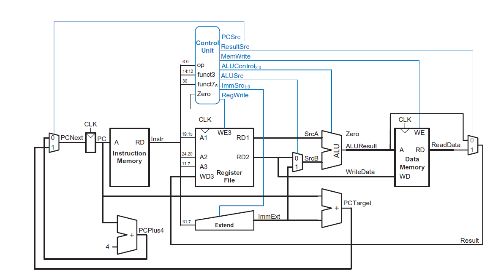

# 🚀 RISC-V Single Cycle Processor (Verilog HDL)

## 📖 Overview
This project implements a **Single-Cycle RISC-V (RV32I) Processor** using **Verilog HDL**, where each instruction is executed in a single clock cycle.

The design includes a complete datapath and control unit, supporting core instruction types such as arithmetic, memory access, and branching.

---

## 🧠 Architecture

  

The processor consists of the following major components:
- Program Counter (PC)
- Instruction Memory
- Register File
- ALU (Arithmetic Logic Unit)
- Data Memory
- Immediate Generator
- Control Unit
- Multiplexers for datapath control

---

## ⚙️ Features
- Implements **RV32I base instruction set**
- Single-cycle execution (CPI = 1)
- Supports:
  - R-type (ADD, SUB, AND, OR, etc.)
  - I-type (ADDI, LW, etc.)
  - S-type (SW)
  - B-type (BEQ)
- Fully synchronous design
- Modular and parameterized Verilog implementation

---

## 🔄 Datapath Flow
1. PC fetches instruction from Instruction Memory  
2. Instruction is decoded by Control Unit  
3. Register File provides operands  
4. ALU performs computation  
5. Data Memory is accessed (if needed)  
6. Result is written back to Register File  
7. PC is updated (sequential or branch target)

---

